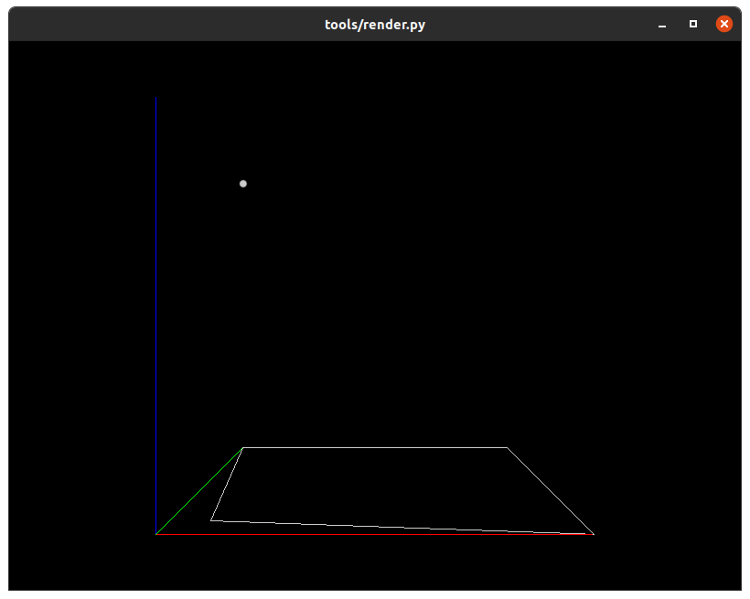
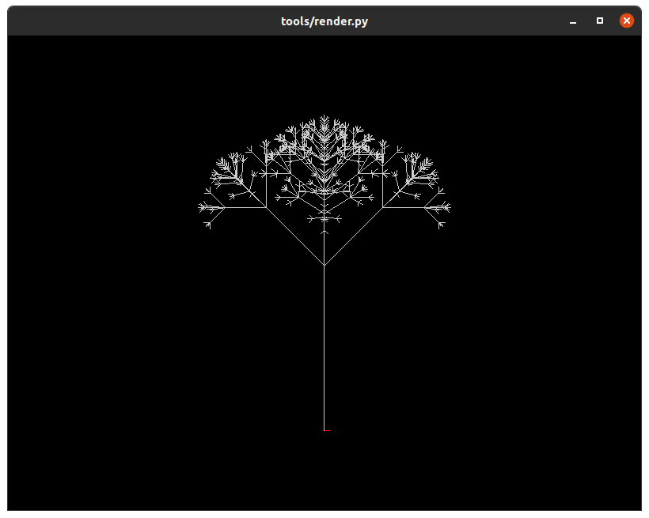
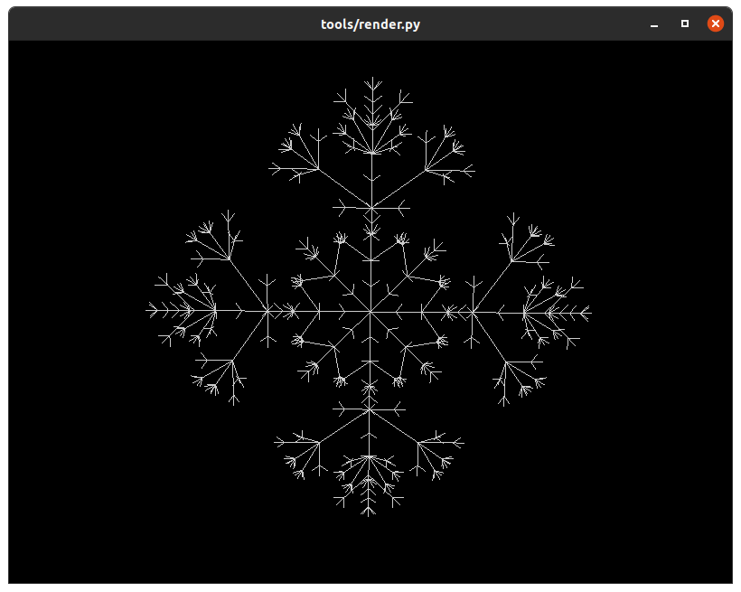
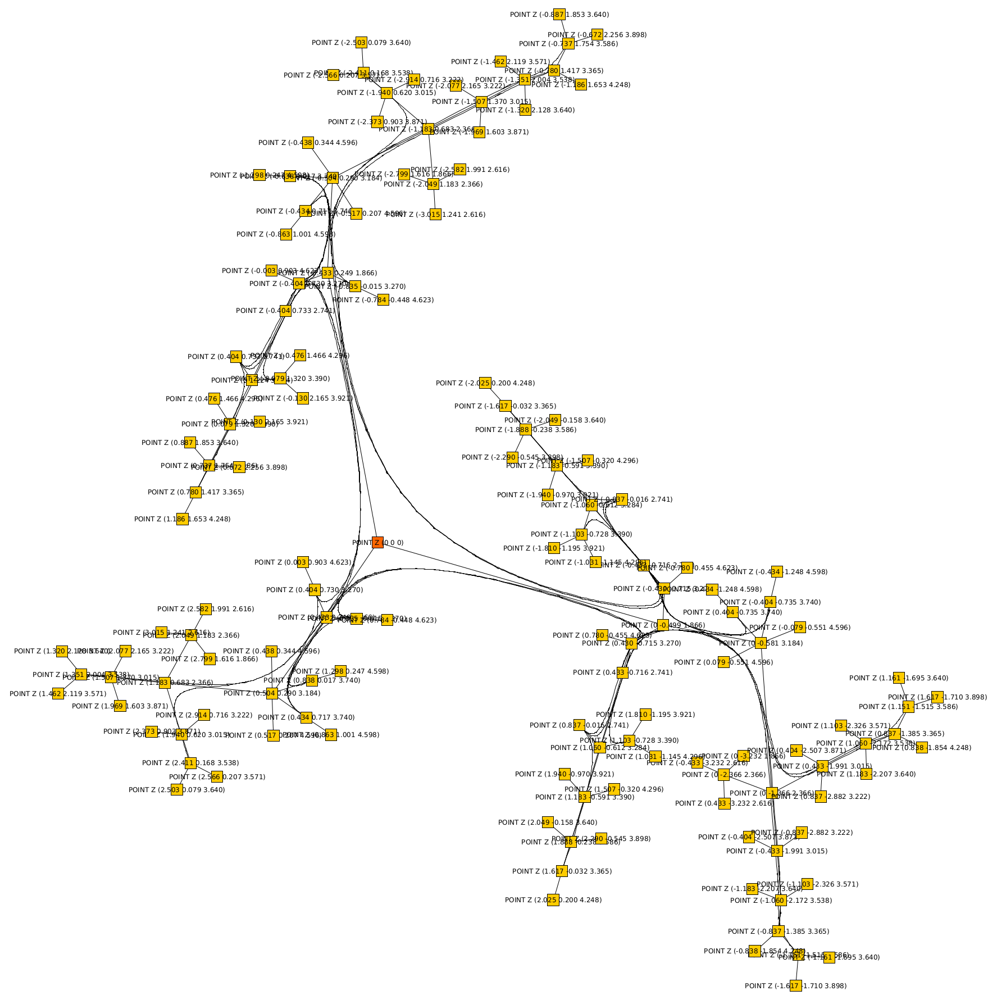
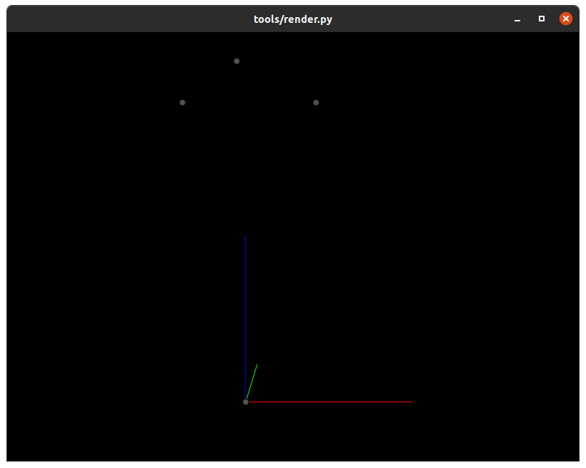

# Generative Art

[](https://github.com/Notgnoshi/generative/actions)
[](https://github.com/Notgnoshi/generative/actions)
[](https://github.com/Notgnoshi/generative/actions)
[](https://github.com/psf/black)

A (re)exploration of 3D Lindenmayer Systems, with the intent of building a composable set of scripts useful for general purpose generative artwork.

I worked on a [class project](https://github.com/macattackftw/fractal_trees) to implement 3D context-free Lindenmayer systems in graduate school.
This is an attempt on doing the same, but with the following improvements:

* Supports context-free, context-sensitive, and stochastic grammars.
* More robust 3D turtle implementation.
* Implemented as a series of scripts that read from `stdin` and write to `stdout`.
    * Intended to be used as a pipeline to allow for inspection and modification of the geometric data.
    * Uses WKT or WKB (in hex) as a standard geometric data format.
    * Each script uses the `logging` module to log at varying levels of verbosity to `stderr`.
* Support for several dimensionality-reduction techniques to project inherently 3D L-System trees to 2D
* 3D OpenGL WKT renderer
* 2D WKT to SVG generation

## Table of Contents

- [L-System Rule Parsing](#l-system-rule-parsing)
  - [Basic Usage](#basic-usage)
  - [Stochastic Grammars](#stochastic-grammars)
  - [Context Sensitive Grammars](#context-sensitive-grammars)
  - [All of the Above](#all-of-the-above)
  - [Why not Parametric?](#why-not-parametric)
- [L-String Interpretation](#l-string-interpretation)
- [Visualization](#visualization)
- [Projections](#projections)
- [SVG Generation](#svg-generation)
  - [Example 1](#example-1)
  - [Example 2](#example-2)
  - [Example 3](#example-3)
- [Converting the WKT to a graph](#converting-the-wkt-to-a-graph)

# L-System Rule Parsing

In [*The Algorithmic Beauty of Plants*](http://algorithmicbotany.org/papers/#abop), Lindenmayer and Prusinkiewicz outlined several types of grammars that could be interpreted as algorithmic models of plans.
These grammars are

1. Context-free grammars
2. Stochastic grammars
3. Context-sensitive grammars
4. Parametric grammars

This project implements a [parser](tools/parse.py) for the first three kinds of grammars.

## Basic Usage

The default mode supports single character tokens.

```shell
$ tools/parse.py --rule 'a -> ab' --rule 'b -> a' --axiom=a --iterations=3
abaab
$ # The default mode also supports comma/whitespace separated tokens if you _really_ like commas
$ tools/parse.py --rule 'a -> a, b' --rule 'b -> a' --axiom=a --iterations=3
abaab
```

There's also parser support for longer tokens, but note this is just an academic exercise in premature flexibility.
The interpreter does not support long tokens, so you almost always want to use the default mode.

```shell
$ tools/parse.py --rule 'a -> a, b' --rule 'b -> a' --axiom=a --iterations=3 --long-tokens
a b a a b
$ tools/parse.py --rule 'a -> ab' --rule 'b -> a' --axiom=a --iterations=30 --long-tokens
ab
$ tools/parse.py --rule 'a -> ab' --rule 'ab -> a, a' --axiom=a --iterations=3 --long-tokens
ab ab
```
## Stochastic Grammars

If more than one production rule is given for a single token, the first rule given will be chosen.

```shell
$ tools/parse.py --rule 'a -> a' --rule 'a -> b' --axiom='aa' --iterations=100
aa
```

Probabilities can be specified like so:

```shell
$ tools/parse.py --rule 'a : 0.5 -> a' --rule 'a : 0.5 -> b' --axiom='aa' --iterations=1 --log-level INFO
2020-08-30 11:36:24,129 - lsystem.grammar - INFO - Using random seed: 4162256033
aa
$ tools/parse.py --rule 'a : 0.5 -> a' --rule 'a : 0.5 -> b' --axiom='aa' --iterations=1 --log-level INFO
2020-08-30 11:36:26,368 - lsystem.grammar - INFO - Using random seed: 635680691
ba
$ tools/parse.py --rule 'a : 0.5 -> a' --rule 'a : 0.5 -> b' --axiom='aa' --iterations=1 --log-level INFO
2020-08-30 11:36:28,439 - lsystem.grammar - INFO - Using random seed: 2707414783
bb
```

A random seed may be given via `--seed`.

## Context Sensitive Grammars

One token of left or right (or both) context may be specified.

```shell
$ tools/parse.py --rule 'a>b -> c' --axiom='ab' --iterations=1
cb
$ tools/parse.py --rule 'b<a -> c' --axiom='ba' --iterations=1
bc
$ tools/parse.py --rule 'b<a>b -> c' --axiom='bab' --iterations=1
bcb
```

Note that tokens without any matching rules are simply passed-through.

You can also specify a list of tokens to ignore when considering context.

```shell
$ tools/parse.py --rule 'b<a>b -> c' --rule='#ignore:a' --axiom='baab' --iterations=1
bccb
```

## All of the Above

See `tools/parse.py --help`. You can mix and match stochastic, context-sensitive, and context-free rules.
It's also possible to pass a JSON config file to avoid incredibly long and hard-to-remember commandline invocations.

However, be aware I've made no attempt at reconciling any cases where rules don't make sense.
If rules are poorly-formatted, expect an exception.
If probabilities don't sum to 1, expect an exception.

## Why not Parametric?

Because I'm writing this for fun.

# L-String Interpretation

`tools/interpret.py` reads L-Strings generated by `tools/parse.py` from `stdin` and writes WKT `LINESTRING Z` output to `stdout`.

```shell
$ tools/parse.py --config examples/sierpinski-tree.json |
    tools/interpret.py |
    tail -n 4
LINESTRING Z (0 -15.48528137423857 32.48528137423855, 0 -16.48528137423857 32.48528137423855, 0 -17.48528137423857 32.48528137423855, 0 -17.48528137423857 32.48528137423855, 0 -17.48528137423857 32.48528137423855, 0 -18.19238815542512 33.1923881554251)
LINESTRING Z (0 -18.48528137423857 32.48528137423855, 0 -18.19238815542512 31.77817459305201)
LINESTRING Z (0 -15.19238815542512 31.77817459305201, 0 -15.89949493661167 31.07106781186546, 0 -16.60660171779822 30.36396103067892, 0 -16.60660171779822 30.36396103067892, 0 -16.60660171779822 30.36396103067892, 0 -17.60660171779822 30.36396103067892)
LINESTRING Z (0 -17.31370849898476 29.65685424949237, 0 -16.60660171779822 29.36396103067892)
```

There are fewer options than `tools/parse.py`, but you can at least configure the step size and angle used by the turtle.
See `tools/interpret.py --help` for more information on how the L-Strings are interpreted.

# Visualization

The [`tools/render.py`](tools/render.py) OpenGL render was implemented to support any WKT/WKB, not just the output of [`tools/interpret.py`](tools/interpret.py) (`LINESTRING Z`).

```shell
{
  echo "POLYGON ((0.1 0.1, 0 1, 1 1, 1 0, 0.1 0.1))";
  echo "Point z (0 1 1)";
} | tools/render.py --axis
```



```shell
tools/parse.py --config examples/fractal-plant-3d.json |
    tools/interpret.py |
    tools/render.py --axis
```



```shell
tools/parse.py --config examples/maya-tree-2.json |
    tools/interpret.py --angle 30 |
    tools/render.py --axis
```


And as a teaser for [2D Projections](#2d-projections), here's the same fractal plant after running PCA.

```shell
tools/parse.py --config examples/fractal-plant-3d.json |
    tools/interpret.py |
    tools/project.py --kind=pca |
    tools/render.py
```



This appears to be a top-down view, which is undesirable. I'd rather have an isometric-ish side view.

# Projections

Notice that even 2D L-Systems generate 3D geometric data.
Before this data can be plotted, it must be projected onto a plane.

```shell
$ tools/parse.py --config examples/sierpinski-tree.json |
    tools/interpret.py |
    tail -n 1
LINESTRING Z (0 -17.31370849898476 29.65685424949237, 0 -16.60660171779822 29.36396103067892)
```

Notice that for this particular L-System, it's the X coordinate that's unused. This can vary.
Sometimes you may need to drop coordinates, or sometimes you may have truly 3D geometries that you need to project to 2D before you can generate an SVG.
`tools/project.py` handles both of these cases.

Using the same example as above, perform PCA on the 3D geometric data to pick an appropriate 2D projection.

```shell
$ tools/parse.py --config examples/sierpinski-tree.json |
    tools/interpret.py |
    tools/project.py
LINESTRING (-1256.101730552664 934.7205554818272, -1249.030662740799 927.6494876699617)
```

See `tools/project.py --help` for details. The script supports the following projection methods

* Drop the X, Y, or Z coordinates
* [PCA](https://scikit-learn.org/stable/modules/generated/sklearn.decomposition.PCA.html#sklearn.decomposition.PCA)
* [SVD](https://scikit-learn.org/stable/modules/generated/sklearn.decomposition.TruncatedSVD.html#sklearn.decomposition.TruncatedSVD)
* **TODO:** Isometric
* **TODO:** 3D variants of the above

I intend on implementing a few more techniques because for this kind of geometric data, none of the above techniques work well with 3D data.
PCA and SVD work pretty well on 3D data with a missing component (like the Sierpinski tree example).

# SVG Generation

Requires using [2D Projections](#2d-projections) to project 3D geometric data onto a plane so it can be converted to SVG.

## Example 1

```shell
$ tools/parse.py --config examples/sierpinski-tree.json |
    tools/interpret.py |
    tools/project.py --kind=yz |
    tools/wkt2svg.py -o examples/sierpinski-tree.svg
$ xdg-open examples/sierpinski-tree.svg
```


We can also use PCA to reduce the dimensionality of our 3D geometries as shown below:

```shell
$ tools/parse.py --config examples/sierpinski-tree.json |
    tools/interpret.py |
    tools/project.py --kind=pca |
    tools/wkt2svg.py -o examples/sierpinski-tree-pca.svg
$ xdg-open examples/sierpinski-tree-pca.svg
```

Interestingly, this flips the tree right-side-up.


## Example 2

Here's another example, showing how all of the scripts in `tools/` were designed to work in a pipeline.
```shell
$ tools/parse.py --config examples/fractal-plant-1.json |
  tools/interpret.py --stepsize=3 --angle=22.5 |
  tools/project.py --kind=yz |
  tools/wkt2svg.py -o examples/fractal-plant-1.svg
$ xdg-open examples/fractal-plant-1.svg
```


## Example 3

Let's try each of the projection techniques on the following plant.


```shell
tools/parse.py --config examples/fractal-plant-3d.json | tools/interpret.py --stepsize=3 --angle=22.5 >/tmp/plant.wkt
for projection in pca svd; do
    tools/project.py --kind=$projection --input /tmp/plant.wkt | tools/wkt2svg.py -o examples/plant-$projection.svg
done
```

* PCA 
* SVD 

# Converting the WKT to a graph

The [`geom2graph` tool](tools/geom2graph) can convert WKT input to [TGF](https://en.wikipedia.org/wiki/Trivial_Graph_Format), where each node in the graph is tagged with its WKT coordinates.
Optionally, the tool can also perform "fuzzy" snapping, where vertices within a specified tolerance are snapped together, and treated as the same vertex.

```shell
$ tools/parse.py --config examples/fractal-plant-1.json |
    tools/interpret.py --stepsize=3 --angle=22.5 |
    tools/project.py --kind=pca --output examples/fractal-plant-1.wkt
$ head examples/fractal-plant-1.wkt
LINESTRING (-244.6453794276828 189.4413011320319, -167.1020575851201 132.8459547012428, -142.1107643324939 91.86504131999683, -138.4076504660449 68.15245083114208, -141.2342426714309 56.49010216097916, -144.7714518233552 51.64364454581902, -147.3327589096831 50.08168871752988, -150.2968327207899 49.61879948422376)
LINESTRING (-147.3327589096831 50.08168871752988, -149.894065996011 48.51973288924074)
LINESTRING (-147.3327589096831 50.08168871752988, -149.894065996011 48.51973288924074, -153.4312751479352 43.6732752740806)
LINESTRING (-149.894065996011 48.51973288924074, -152.8581398071178 48.05684365593462)
LINESTRING (-144.7714518233552 51.64364454581902, -146.5400563993173 49.22041573823896, -149.1013634856452 47.65845990994982)
LINESTRING (-146.5400563993173 49.22041573823896, -148.3086609752794 46.7971869306589)
LINESTRING (-146.5400563993173 49.22041573823896, -148.3086609752794 46.7971869306589, -149.7219570779724 40.96601259557747)
LINESTRING (-148.3086609752794 46.7971869306589, -150.8699680616073 45.23523110236977)
LINESTRING (-144.7714518233552 51.64364454581902, -148.3086609752794 46.7971869306589, -150.4286051293189 38.0504254280367, -152.197209705281 35.62719662045667)
LINESTRING (-150.4286051293189 38.0504254280367, -151.1352531806654 35.134838260496)
$ tools/geom2graph/build/src/geom2graph \
    --tolerance=0.001 \
    --input examples/fractal-plant-1.wkt \
    --output examples/fractal-plant-1.tgf
$ head examples/fractal-plant-1.tgf
0	POINT (-244.6453794276828 189.4413011320319)
1	POINT (-167.1020575851201 132.8459547012428)
2	POINT (-142.1107643324939 91.86504131999683)
3	POINT (-138.4076504660449 68.15245083114208)
4	POINT (-141.2342426714309 56.49010216097916)
5	POINT (-144.7714518233552 51.64364454581902)
6	POINT (-147.3327589096831 50.08168871752988)
7	POINT (-150.2968327207899 49.61879948422376)
8	POINT (-149.894065996011 48.51973288924074)
9	POINT (-152.4741132487238 44.98471725450483)
$ tail examples/fractal-plant-1.tgf
6254	6259
6254	6265
6255	6259
6255	6266
6255	6267
6258	6260
6260	6261
6260	6262
6262	6263
6262	6264
```

The `geom2graph` tool also works on 3D geometries, and even mixed 2D and 3D input, where it assumes the Z coordinate of the 2D geometries is 0.

```shell
$ tools/parse.py --config examples/maya-tree-2.json |
    tools/interpret.py \
        --stepsize=1 \
        --angle=30 \
        --output=examples/maya-tree-2.wkt
$ head examples/maya-tree-2.wkt
LINESTRING Z (0 0 0, 0 0 1, 0 -0.4999999999999999 1.866025403784439, 0 -1.366025403784439 2.366025403784439, 0 -2.366025403784438 2.366025403784439, 0 -3.232050807568877 1.866025403784439)
LINESTRING Z (0 -2.366025403784438 2.366025403784439, -0.4330127018922194 -3.232050807568877 2.616025403784439)
LINESTRING Z (0 -2.366025403784438 2.366025403784439, 0.4330127018922194 -3.232050807568877 2.616025403784439)
LINESTRING Z (0 -1.366025403784439 2.366025403784439, -0.4330127018922194 -1.991025403784439 3.015544456622768, -1.183012701892219 -2.207531754730549 3.640544456622768)
LINESTRING Z (-0.4330127018922194 -1.991025403784439 3.015544456622768, -0.4040063509461099 -2.507171044359295 3.871553983041933)
LINESTRING Z (-0.4330127018922194 -1.991025403784439 3.015544456622768, -0.837019052838329 -2.882171044359295 3.222034930203604)
LINESTRING Z (0 -1.366025403784439 2.366025403784439, 0.4330127018922194 -1.991025403784439 3.015544456622768, 1.183012701892219 -2.207531754730549 3.640544456622768)
LINESTRING Z (0.4330127018922194 -1.991025403784439 3.015544456622768, 0.837019052838329 -2.882171044359295 3.222034930203604)
LINESTRING Z (0.4330127018922194 -1.991025403784439 3.015544456622768, 0.4040063509461099 -2.507171044359295 3.871553983041933)
LINESTRING Z (0 -0.4999999999999999 1.866025403784439, -0.4330127018922194 -0.7165063509461098 2.741025403784439, -1.18301270189222 -0.59150635094611 3.390544456622768, -2.049038105676659 -0.1584936490538911 3.640544456622768)
```

This is what the geometries look like when rendered:


So let's run the `geom2graph` tool, and visualize the resulting directed graph.

```shell
$ tools/geom2graph/build/src/geom2graph \
    --tolerance=0.001 \
    --input examples/maya-tree-2.wkt \
    --output examples/maya-tree-2.tgf
$ head examples/maya-tree-2.tgf
0	POINT Z (0 0 0)
1	POINT Z (0 -0.4999999999999999 1.866025403784439)
2	POINT Z (0 -0.5819930716951528 3.184712085553997)
3	POINT Z (0 -1.366025403784439 2.366025403784439)
4	POINT Z (0 -2.366025403784438 2.366025403784439)
5	POINT Z (0 -3.232050807568877 1.866025403784439)
6	POINT Z (-0.4330127018922194 -3.232050807568877 2.616025403784439)
7	POINT Z (0.4330127018922194 -3.232050807568877 2.616025403784439)
8	POINT Z (-0.4330127018922194 -1.991025403784439 3.015544456622768)
9	POINT Z (-1.06002309434949 -2.172027713219388 3.538053117003827)
$ tail examples/maya-tree-2.tgf
127	130
131	132
131	141
131	143
132	137
132	141
133	135
133	136
137	139
141	144
```

which, when visualized in a graph viewer, looks like this:



The origin has been colored orange, and you can see the remarkable symmetry that's displayed, even with an organic layout.
Notice that the edges are directed, and thus there's two directed edges for every logical edge.

Interestingly, there seems to be three nodes adjacent to the origin, when the OpenGL visualizer shows a single vertical trunk.
Given my understanding of the problem, I think this is because the turtle spends a lot of time retracing its steps.

Note that we were able to **significantly** reduce the amount of retracing from the original `maya-tree`, by rewriting its L-System rules, while maintaining the same visual appearance.
Let's visualize the points close to the origin to double check.

A pruned version of the TGF output is shown below, showing the origin's neighbors.

```tgf
0	POINT Z (0 0 0)
1	POINT Z (0 -0.4999999999999999 1.866025403784439)
52	POINT Z (-0.4330127018922194 0.2499999999999999 1.866025403784439)
100	POINT Z (0.4330127018922194 0.2499999999999999 1.866025403784439)
#
0	1
0	52
0	100
```

We can visualize these four nodes by piping them directly into the OpenGL renderer:

```shell
tools/renderer.py --axis << EOF
POINT Z (0 0 0)
POINT Z (0 -0.4999999999999999 1.866025403784439)
POINT Z (-0.4330127018922194 0.2499999999999999 1.866025403784439)
POINT Z (0.4330127018922194 0.2499999999999999 1.866025403784439)
EOF
```



Apparently the "trunk" is actually three distinct (non overlapping collinear) segments.
It will be interesting to look at this again, once I'm able to parse the graph output as a geometry collection, so that we can snap close vertices together, and then look at the resulting geometry.
