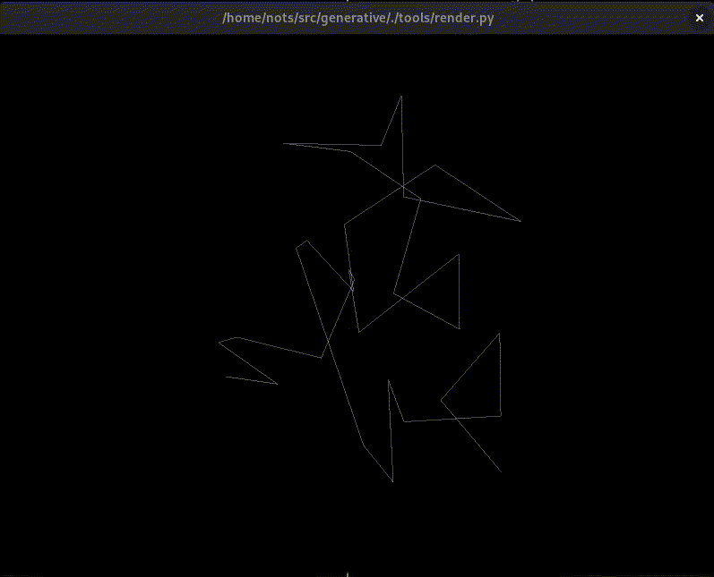
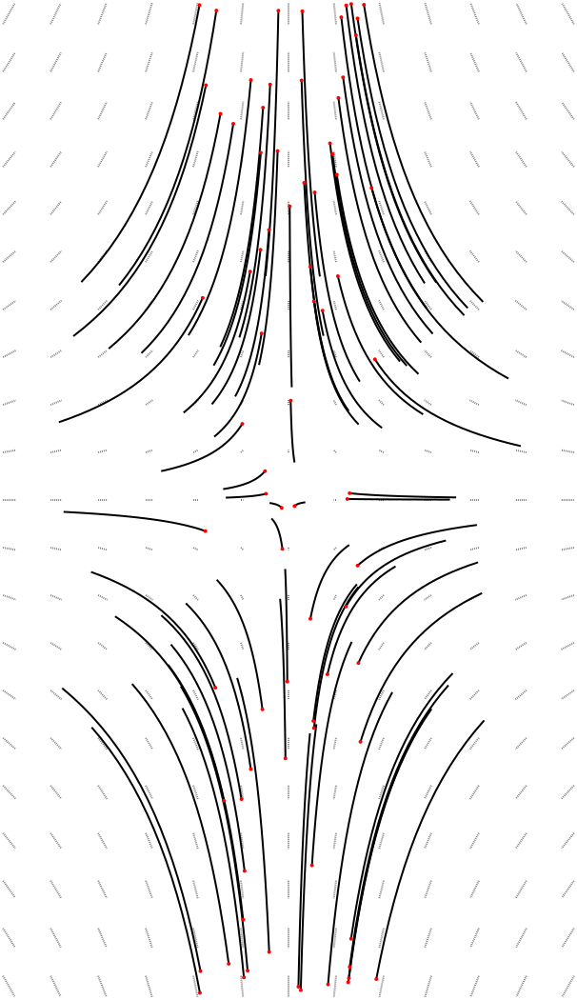
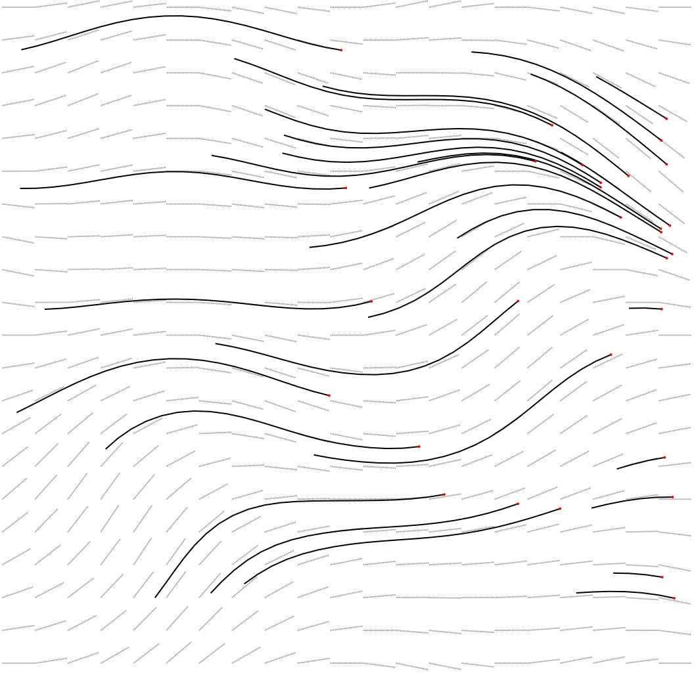
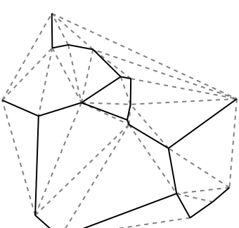
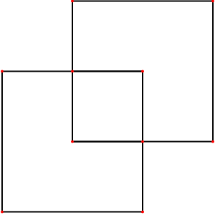

# Generative Art

[](https://github.com/Notgnoshi/generative/actions)
[](https://github.com/Notgnoshi/generative/actions)
[](https://github.com/Notgnoshi/generative/actions)
[](https://github.com/psf/black)

A polyglot collection of composable generative art tools, with a focus on 2D computational geometry.

# Table of contents

* [How to build](#how-to-build)
* [Philosophy](#philosophy)
* [Examples](#examples)
  * [Asemic writing](#asemic-writing)
  * [Random L-Systems](#random-l-systems)
* [The tools](#the-tools)
  * [Lindenmayer systems](#lindenmayer-systems)
    * [parse-production-rules.py](#parse-production-rulespy)
    * [random-production-rules.py](#random-production-rulespy)
    * [interpret-lstring.py](#interpret-lstringpy)
    * [random-lsystem.sh](#random-lsystemsh)
  * [Generation](#generation)
    * [point-cloud](#point-cloud)
    * [grid](#grid)
  * [Algorithms](#algorithms)
    * [bitwise](#bitwise)
    * [dla](#dla)
    * [streamline](#streamline)
    * [traverse](#traverse)
    * [urquhart](#urquhart)
  * [Transformations](#transformations)
    * [project.py](#projectpy)
    * [geom2graph](#geom2graph)
    * [smooth](#smooth)
    * [snap](#snap)
    * [transform](#transform)
  * [Utilities](#utilities)
    * [wkt2svg](#wkt2svg)
    * [render.py](#renderpy)
    * [bundle](#bundle)
    * [pack](#pack)

# How to build
This project contains a mix of Rust, C++, and Python. It's primarily Rust.

Install dependencies with
```sh
# Python dependencies
python3 -m venv --prompt generative .venv
source .venv/bin/activate
python3 -m pip install -r requirements.txt
# C++ dependencies
sudo apt install build-essential cmake ninja-build
git submodule update --init --recursive
```

The Rust build has been configured to also perform the C++ CMake build, so all you need is
```sh
cargo build
```

If you don't want to build the C++ parts, you can do
```sh
cargo build --no-default-features
```
but note that this will disable building the [`geom2graph`](#geom2graph) tool.

You can run the Python tests with
```sh
source .venv/bin/activate
pytest
```
and the Rust tests with
```sh
cargo test
```
If the C++ tests have been enabled with `--all-features`, or `--features=cxx-tests`, they are copied
to `target/debug/cxx-tests`.

Throughout this entire document, it is assumed that each of the tool binaries has been added to your
PATH with
```sh
export PATH=$PWD/target/debug/:$PATH
```

# Philosophy

There is a [`generative`](./generative/) Rust/C++/Python library, but the user is expected to use
the [CLI tools](./tools/) instead. I'm enamored with the Unix philosophy, so each tool does its best
to produce/consume a standard textual interface.
* Each tool read/writes to/from `stdin`/`stdout`
* Logging is done to `stderr`
* Geometries are in [WKT](https://en.wikipedia.org/wiki/Well-known_text_representation_of_geometry)
  format, one geometry per line
* Graphs are in [TGF](https://en.wikipedia.org/wiki/Trivial_Graph_Format) format

# Examples
## Asemic writing
The following snippet generates random asemic writing glyphs
```sh
glyphs() {
    local glyph_kind="$1"
    local number="$2"
    local size="$3"

    {
        for _ in $(seq "$number"); do
            $glyph_kind "$size"
        done
    } | pack --width 1000 --height 1000 --padding 20
}
```

To generate random glyphs, we'll:
1. Take a geometry graph
2. Perform random traverals of the graph
3. (optionally) Smooth each traversal into a curve
```sh
random_rounded() {
    local size="$1"
    point-cloud --log-level WARN --domain unit-square --points 15 --scale 6 |
        urquhart --output-format tgf |
        traverse --log-level WARN --traversals 5 --length 5 --untraversed |
        transform --scale="$size" |
        smooth --iterations 4 |
        bundle
}
glyphs random_rounded 90 10 | wkt2svg --output $ASEMIC_RANDOM_ROUNDED
```

The `--untraversed` points could be replaced with diacritical marks.

We could also use the triangulation of a random point cloud
```sh
random_triangulated() {
    local size="$1"
    point-cloud --log-level WARN --domain unit-square --points 10 --scale 6 |
        triangulate --output-format tgf |
        traverse --log-level WARN --traversals 3 --length 3 --remove-after-traverse |
        transform --scale="$size" |
        smooth --iterations 4 |
        bundle
}
glyphs random_triangulated 100 10 | wkt2svg --output $ASEMIC_RANDOM_TRIANGULATED
```


Neither of these approaches give a coherent sense of self-similarity that's necessary for linguistic
glyphs. If, instead of using a random point cloud, we use a regular grid, that dramatically changes
the sense of self-similarity.
```sh
grid_rounded() {
    local size="$1"
    grid --output-format graph --width=2 --height=3 |
        traverse --log-level WARN --traversals 5 --length 5 --remove-after-traverse |
        transform --scale="$size" |
        smooth --iterations 4 |
        bundle
}
glyphs grid_rounded 120 20 | wkt2svg --output $ASEMIC_GRID_ROUNDED
```


We can also reduce the number of smoothing iterations to get beveled corners
```sh
grid_beveled() {
    local size="$1"
    grid --output-format graph --width=2 --height=3 |
        traverse --log-level WARN --traversals 5 --length 5 --remove-after-traverse |
        transform --scale="$size" |
        smooth --iterations 1 |
        bundle
}
glyphs grid_beveled 120 20 | wkt2svg --output $ASEMIC_GRID_BEVELED
```


We could also regular triangle grid, to get loopier results, with no vertical lines
```sh
grid_triangulated() {
    local size="$1"
    grid --grid-type triangle --output-format graph --width=2 --height=3 |
        traverse --log-level WARN --traversals 4 --length 5 --remove-after-traverse |
        transform --scale="$size" |
        smooth --iterations 4 |
        bundle
}
glyphs grid_triangulated 100 20 | wkt2svg --output $ASEMIC_GRID_TRIANGULATED
```


Using a slanted grid makes _almost_ compelling cursive, if only the jarring horizontal lines were
removed.
```sh
grid_jagged() {
    local size="$1"
    grid --grid-type ragged --output-format graph --width=2 --height=3 |
        traverse --log-level WARN --traversals 4 --length 5 --remove-after-traverse |
        transform --scale="$size" |
        smooth --iterations 4 |
        bundle
}
glyphs grid_jagged 100 20 | wkt2svg --output $ASEMIC_GRID_JAGGED
```


If we use a radial grid with no point filling between the spokes, smooth after the traversals, we
results without much self-symmetry.
```sh
grid_radial() {
    local size="$1"
    grid --grid-type radial --output-format graph --width=5 --height=3 |
        traverse --log-level WARN --traversals 5 --length 5 --remove-after-traverse |
        transform --scale="$size" |
        smooth --iterations 4 |
        bundle
}
glyphs grid_radial 75 10 | wkt2svg --output $ASEMIC_GRID_RADIAL
```


If instead we use a radial grid with a high point density along the rings, we get more compelling
glyphs reminiscent of a circular maze.
```sh
grid_radial_dense() {
    local size="$1"
    grid --grid-type radial --output-format graph --width=5 --height=4 --ring-fill-ratio=0.7 |
        traverse --log-level WARN --traversals 10 --length 30 |
        transform --scale="$size" |
        bundle
}
glyphs grid_radial_dense 64 10 | wkt2svg --output $ASEMIC_GRID_RADIAL_DENSE
```


## Random L-Systems
[examples/random-lsystems/saved.json](examples/random-lsystems/saved.json) contains parameters for
randomly (pre)generated Lindenmayer systems.
```sh
for i in $(seq 0 13); do
    jq ".[$i]" examples/random-lsystems/saved.json |
        tools/parse-production-rules.py -c - -n "$(jq ".[$i].iterations" examples/random-lsystems/saved.json)" |
        tools/interpret-lstring.py -l ERROR -a "$(jq ".[$i].angle" examples/random-lsystems/saved.json)" |
        tools/project.py --scale "$(jq ".[$i].scale" examples/random-lsystems/saved.json)" --kind pca |
        wkt2svg --output "examples/random-lsystems/random-$i.svg"
done
```


# The tools

## Lindenmayer Systems
### parse-production-rules.py
The `parse-production-rules.py` tool takes a set of production rules, and a starting axiom, and
interprets the rules on the axiom for some specified number of iterations
```sh
$ ./tools/parse-production-rules.py --rule 'a -> ab' --rule 'b -> a' --axiom a --iterations 3
abaab
```

This tool supports context-free, stochastic, and context-sensitive grammars, with rules of the form
```
[left_context<] lhs [>right_context] [:probability] -> rhs
#ignore: tok1,tok2,tok3
```
The `[]` square brackets denote optional parts of the production rule.

### random-production-rules.py
The `random-production-rules.py` tool generates a random set of production rules in JSON form that
`parse-production-rules.py --config` knows how to read.
```sh
$ ./tools/random-production-rules.py --seed 4290989563 |
    ./tools/parse-production-rules.py --config - --iterations 3
|v]->^][<>^[[
```

### interpret-lstring.py
These L-strings can then be interpreted with a 3D turtle. Each symbol controls the turtle's motion
through space.
```sh
$ ./tools/parse-production-rules.py --config ./examples/lsystems/sierpinski-tree.json |
    ./tools/interpret-lstring.py |
    tail -n 4
LINESTRING Z (0 -126.48885271170681 224.54772721475285, 0 -125.48885271170681 224.54772721475285)
LINESTRING Z (0 -128.61017305526647 226.6690475583125, 0 -125.61017305526647 226.6690475583125, 0 -124.90306627407992 225.96194077712596)
LINESTRING Z (0 -125.61017305526647 226.6690475583125, 0 -124.61017305526647 226.6690475583125)
LINESTRING Z (0 -125.61017305526647 226.6690475583125, 0 -124.90306627407992 227.37615433949907)
```
Notice that the geometries are in 3D WKT. They can be rendered in an interactive 3D OpenGL viewer
([render.py](#renderpy)) or projected to 2D ([project.py](#projectpy) before being converted to SVG
with [wkt2svg](#wkt2svg).

```sh
./tools/parse-production-rules.py --config ./examples/lsystems/sierpinski-tree.json |
    ./tools/interpret-lstring.py |
    ./tools/project.py --kind=yz |
    wkt2svg --output ./examples/lsystems/sierpinski-tree.svg
```


### random-lsystem.sh
`random-production-rules.py` generates a great many duds (See
[#83](https://github.com/Notgnoshi/generative/issues/83)), so `random-lsystem.sh` is an easy way of
generating and visualizing random L-Systems quickly.
```
$ ./tools/random-lsystem.sh
2024-03-03 08:57:05,580 - tools/random-production-rules.py - INFO - Using random seed 1063093925
{"seed": 1063093925, "rules": ["G -> [>[v[[|v-|<F>GG[v", "G -> v]<|", "F -> <^v"], "axiom": "G"}
2024-03-03 08:57:05,926 - tools/render.py - INFO - Loaded 64 segments and 0 points.
```

<!-- GitHub doesn't support inline .webm :( -->
<!-- ffmpeg -i examples/lsystems/random-lsystem.webm -pix_fmt rgb8 examples/lsystems/random-lsystem.gif -->


## Generation
The generation-type tools generate input data for other tools to consume.

### point-cloud
`point-cloud` is a tool that generates random points in the unit circle or square.
```sh
$ point-cloud --points 4 --domain unit-circle --scale 100 --seed 15838575381579332872
POINT (30.224877936836876 -70.83712102787706)
POINT (-38.04972657419976 -33.95658816921603)
POINT (-1.7494655022386558 -3.0116273192492646)
POINT (-4.305088398836983 10.443819974018535)
```

### grid
The `grid` tool generates different kinds of grids:
* `triangle`
* `quad`
* `ragged`
* `hexagon`
* `radial`
and supports outputting the resulting grid in TGF graph format, WKT POINTs, or WKT LINESTRINGs.

```sh
$ grid --output-format graph --grid-type quad --width 1 --height 1
0	POINT(0 0)
1	POINT(1 0)
2	POINT(0 1)
3	POINT(1 1)
#
0	2
0	1
1	3
2	3
```
```sh
$ grid --output-format lines --grid-type hexagon --size 20 |
    wkt2svg --output ./examples/grid/hex.svg
```


```sh
$ grid --output-format lines --grid-type radial --size 20 |
    wkt2svg --output ./examples/grid/radial.svg
```


There's `--ring-fill-points` and `--ring-fill-ratio` options for filling in the points along the
rings to get a smoother radial grid. You may also use the [smooth](#smooth) tool to get smoother
curves.
```sh
$ grid --output-format lines --grid-type radial --ring-fill-ratio 0.3 --size 20 |
    wkt2svg --output ./examples/grid/radial-filled.svg
```


## Algorithms
### bitwise
The bitwise tool was inspired by <https://www.reddit.com/r/generative/comments/10hk4jg/big_renfest_crest_energy_bitwise_operations_svg>.
It takes an arbitrary expression on `(x, y)`, and visualizes the pattern resulting from connecting
adjacent non-zero cells with a line. The particulars of the pattern are highly influenced by
* Using modular arithmetic (and prime numbers) in the expression
* The order in width adjacent cells are searched (only the first hit is connected via a line)

A better number-theorist than me could probably extract some meaning from the resulting patterns.

```sh
$ bitwise "(x & y) & (x ^ y) % 13" |
    wkt2svg --scale 10 --output ./examples/bitwise/expr1.svg
```


```sh
$ bitwise "(x & y) & (x ^ y) % 11" |
    wkt2svg --scale 10 --output ./examples/bitwise/expr2.svg
```


Changing the search order doesn't change which cells are non-zero, just which cells are connected
via a line.
```sh
$ bitwise "(x & y) & (x ^ y) % 11" --neighbor-search-order south-west,south-east,south,east |
    wkt2svg --scale 10 --output ./examples/bitwise/expr3.svg
```


### dla
The `dla` tool uses [Diffusion Limited
Aggregation](https://en.wikipedia.org/wiki/Diffusion-limited_aggregation) to generate fractal
growths like snowflakes, lightning, and river networks (in mountainous terrain anyways)

```sh
$ dla \
    --seed 461266331856721221 \
    --seeds 2 \
    --attraction-distance 10 \
    --min-move-distance 1 \
    --stubbornness 10 \
    --particle-spacing 0.1 |
    geom2graph --graph2geom --tolerance=0.001 |
    wkt2svg --scale 30 --output ./examples/dla/organic.svg
```


There are a huge number of tunable parameters to play with, and it's quite hard to get an intuitive
sense for the impact of each.

### streamline
The `streamline` tool can be used to trace geometry streamlines in a vector field.
You can define your own vector field as a function of `(x, y)`, or a random Perlin noise field will
be used.

```sh
$ point-cloud \
    --points 80 \
    --seed=4628778017671551752 \
    --domain=unit-square |
    transform \
        --offset-x=-0.5 \
        --offset-y=-0.5 |
    streamline \
        --min-x=-0.6 \
        --max-x=0.7 \
        --min-y=-1 \
        --max-y=1 \
        --delta-h=0.1 \
        --time-steps=20 \
        --function "let temp = sqrt(x ** 2.0 + y ** 2.0 + 4.0); x = -sin(x) / temp; y = y / temp;" \
        --draw-vector-field \
        --vector-field-style="STROKE(gray)" \
        --vector-field-style="STROKEDASHARRAY(1)" \
        --streamline-style="STROKE(black)" \
        --streamline-style="STROKEDASHARRAY(0)" \
        --draw-geometries \
        --geometry-style="STROKE(red)" |
    wkt2svg \
        --scale 500 --output ./examples/streamline/field1.svg
```


```sh
$ point-cloud \
    --seed=5882435996591106192 \
    --points 30 \
    --scale 2 \
    --domain=unit-square |
    streamline \
        --seed=192545950949821414 \
        --max-x=2.0 \
        --max-y=2.0 \
        --delta-h=0.1 \
        --delta-t=0.05 \
        --time-steps=20 \
        --draw-vector-field \
        --vector-field-style="STROKE(gray)" \
        --vector-field-style="STROKEDASHARRAY(1)" \
        --streamline-style="STROKE(black)" \
        --streamline-style="STROKEDASHARRAY(0)" \
        --draw-geometries \
        --geometry-style="STROKE(red)" |
    wkt2svg \
        --scale 500 --output ./examples/streamline/field2.svg
```


### traverse
The `traverse` tool performs random walks on the given graph.
```sh
$ grid --grid-type hexagon --output-format graph |
    traverse \
        --seed=10268415722561053759 \
        --traversals 2 \
        --length 20 \
        --untraversed |
    wkt2svg --scale 100 --output ./examples/traverse/hex-walk.svg
```


### triangulate
The `triangulate` tool finds the Delaunay triangulation of the given geometries. It can triangulate
individual geometries, or relax all geometries into a point cloud, and triangulate the point cloud.

```sh
$ point-cloud --seed 11878883030565683752 --points 20 --scale 200 |
    triangulate | sort | tee /tmp/triangulation.wkt |
    wkt2svg --output ./examples/urquhart/triangulation.svg
```


### urquhart
The [Urquhart Graph](https://en.wikipedia.org/wiki/Urquhart_graph) is a computationally easy(ish)
approximation to the [Relative Neighborhood
Graph](https://en.wikipedia.org/wiki/Relative_neighborhood_graph). It's formed from the Delaunay
triangulation.

```sh
point-cloud --seed 11878883030565683752 --points 20 --scale 200 |
    urquhart | sort >/tmp/urquhart.wkt
{
    echo "STROKE(gray)"
    echo "STROKEDASHARRAY(6)"
    # the triangulation minus the urquhart graph
    comm -23 /tmp/triangulation.wkt /tmp/urquhart.wkt
    echo "STROKE(black)"
    echo "STROKEDASHARRAY(none)"
    cat /tmp/urquhart.wkt
} | wkt2svg --output ./examples/urquhart/urquhart.svg
```


## Transformations
### project.py
The `project.py` tool can be used to project 3D geometries to 2D. It supports several projection
types, I recommend PCA or isometric.

```sh
$ ./tools/project.py --kind=isometric --input=examples/unit-cube.wkt |
    wkt2svg --scale=200 --output ./examples/project/isometric.svg
```


### transform
The `transform` tool can be used to apply affine transformations to the given geometries; rotation,
scale, offset, and skew (applied in that order). Note that `wkt2svg` can also scale geometries,
because it's very common for the generative algorithms to work on a sub-pixel scale.

```sh
$ transform <examples/unit-square.wkt \
    --rotation=45 |
    transform --scale=200 --scale-x=0.8 |
    wkt2svg --output ./examples/transform/square.svg
```


### geom2graph
The `geom2graph` tool converts back and forth between WKT geometries, and their TGF connection-graph
representation. It can be useful to de-duplicate vertices and overlapping segments, find all-pairs
intersections, and convert to a graph representation of a set of geometries useful for other kinds
of algorithms (See [Asemic Writing](#asemic-writing) above).

```sh
# Offset the unit square to result in two overlapping geometries
transform <examples/unit-square.wkt --offset-x=0.5 --offset-y=0.5 >/tmp/offset-square.wkt
cat examples/unit-square.wkt /tmp/offset-square.wkt | geom2graph >/tmp/graph.tgf
```
this give a TGF graph
```
0	POINT(0 0)
1	POINT(0 1)
2	POINT(0.5 1)
3	POINT(1 1)
4	POINT(1 0.5)
5	POINT(1 0)
6	POINT(0.5 0.5)
7	POINT(0.5 1.5)
8	POINT(1.5 1.5)
9	POINT(1.5 0.5)
#
0	5
0	1
1	2
2	7
2	6
2	3
3	4
4	6
4	9
4	5
7	8
8	9
```
that we can observe has the intersection points added
```sh
# Extract the vertices, so we can overlay them
grep --only-matching 'POINT.*$' /tmp/graph.tgf >/tmp/vertices.wkt
# Convert graph back into a set of geometries
geom2graph --graph2geom </tmp/graph.tgf >/tmp/offset-squares.wkt

{
    cat /tmp/offset-squares.wkt
    echo "STROKE(red)"
    cat /tmp/vertices.wkt
} | wkt2svg --scale=200 --output ./examples/geom2graph/offset-squares.svg
```


> **NOTE:** Converting the graph back into a set of geometries is sub-optimal; it returns a set of
> polygons, and returns anything else as a set of "dangles" each of which is a single line segment,
> even if the original geometry was all one big long connected linestring.

### smooth
The `smooth` tool smooths geometries.
```sh
smooth <examples/unit-square.wkt --iterations 1 |
    wkt2svg --scale=200 --output=examples/smooth/beveled.svg
```


```sh
smooth <examples/unit-square.wkt --iterations 5 |
    wkt2svg --scale=200 --output=examples/smooth/rounded.svg
```


### snap
The `snap` tool snaps geometry vertices together with some tolerance; either to a regular grid, or
to the closest vertex of a nearby geometry.

To demonstrate, start with a couple of squares offset from each other by `0.1`
```sh
generate_grid() {
    transform <examples/unit-square.wkt --offset-y=1.1
    transform <examples/unit-square.wkt --offset-x=1.1 --offset-y=1.1
    cat examples/unit-square.wkt
    transform <examples/unit-square.wkt --offset-x=1.1
}

generate_grid | wkt2svg --scale=200 --output=examples/snap/grid.svg
```


You can snap the vertices of the geometries to the closest nearby points
```sh
generate_grid |
    geom2graph |
    snap --input-format=tgf --strategy=closest-point --tolerance=0.2 |
    geom2graph --graph2geom |
    wkt2svg --scale=200 --output=examples/snap/snap-closest.svg
```


Or you can snap the vertices of the geometries to a regular grid centered at `(0, 0)` with spacing
given by the `--tolerance` flag.
```sh
generate_grid |
    geom2graph |
    snap --input-format=tgf --strategy=regular-grid --tolerance=1.0 |
    geom2graph --graph2geom |
    wkt2svg --scale=200 --output=examples/snap/snap-grid.svg
```


The `snap` tool can snap both geometries and geometry graphs. It is cheaper to snap graphs, because
the first stage of snapping geometries is to build the graph representation.

> **Note:** The `snap` tool is sensitive to the ordering of geometries, and to the ordering of the
> vertices in each geometry.

## Utilities
### bundle
The `bundle` tool is a simple tool that bundles multiple geometries together into a single
`GEOMETRYCOLLECTION`. This is useful when combined with the [`pack`](#pack) tool.
```sh
bundle <<EOF
POINT(0 0)
POINT(1 1)
EOF
```
```
GEOMETRYCOLLECTION(POINT(0 0),POINT(1 1))
```

### pack
The `pack` tool is a rectangle packing tool. For each input geometry (a `GEOMETRYCOLLECTION` is
considered a single geometry), the tool will determine the axis-aligned bounding box, and attempt to
pack each geometry into a rectangular region of a fixed size.


```sh
cat examples/unit-square.wkt examples/unit-square.wkt examples/unit-square.wkt examples/unit-square.wkt |
    transform --scale=200 >/tmp/squares.wkt

pack --padding=10 --width=450 --height=450 </tmp/squares.wkt |
    wkt2svg --output=examples/pack/squares.svg
```


> **Note:** The rectangular region should be big enough that each of the geometries fits, but small
> enough that it generates an appealing packing.

> **Note:** The packing algorithm uses integer coordinates, so you may need to scale up your
> geometries to enable more control.

### render.py
The `render.py` tool can be used to interactively render 2D and 3D WKT geometries in an OpenGL
visualizer.

```sh
$ tools/parse-production-rules.py --config examples/maya-tree-2.json |
    tools/interpret-lstring.py --angle 30 |
    tools/render.py --axis
```


### wkt2svg
The `wkt2svg` tool can be used to render 2D WKT geometries to an SVG image.

> **Note:** `wkt2svg` only accepts 2D geometries. If you have 3D geometries, you'll need to use
> [`project.py`](#projectpy) to project the 3D geometries down to 2D.

Additionally, `wkt2svg` supports styling through its CLI arguments (to override the global default)
or by the use of commands that can be interleaved with the WKT being processed.
* `POINTRADIUS(1.0)` - Can be used to set the radius of WKT `POINT`s
* `STROKE(black)` - Can be used to set the color of geometries
* `STROKEWIDTH(2.0)` - Can be used to set the width lines
* `FILL(red)` - Can be used to fill in `POLYGON`s and `POINT`s (if the `POINTRADIUS` is large enough
  that there's an interior to fill).
* `STROKEDASHARRAY(...)` - Can be used to draw dotted lines; See [the MDN
  docs](https://developer.mozilla.org/en-US/docs/Web/SVG/Attribute/stroke-dasharray) for help.

```sh
wkt2svg --output=examples/wkt2svg/styles.svg <<EOF
POINT(0 0)
POINT(100 100)
STROKEWIDTH(4)
STROKEDASHARRAY(6 1)
POINTRADIUS(20)
FILL(red)
POINT(50 50)
EOF
```

