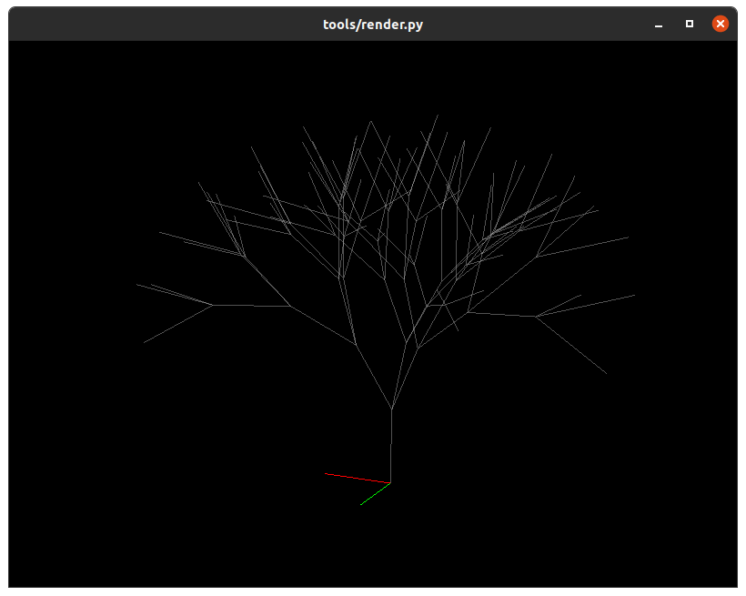
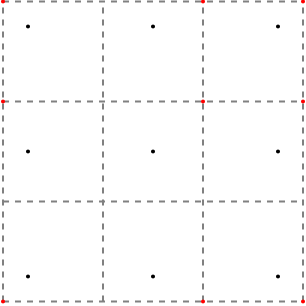
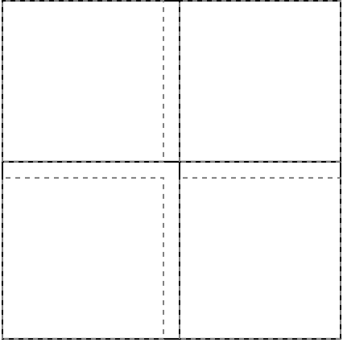
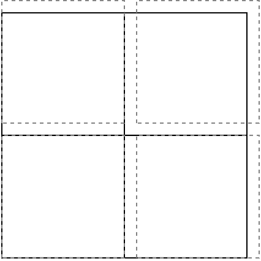
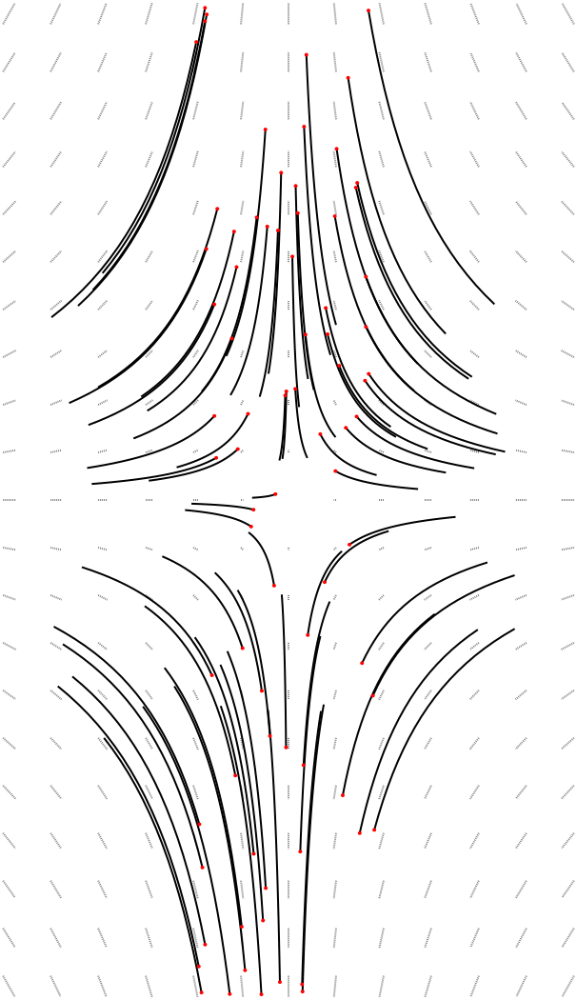
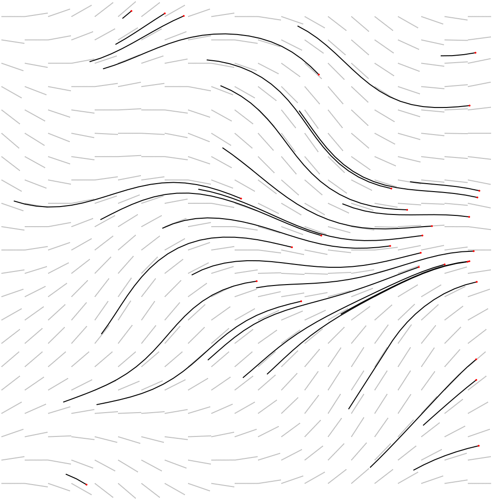

# Generative Art

[](https://github.com/Notgnoshi/generative/actions)
[](https://github.com/Notgnoshi/generative/actions)
[](https://github.com/Notgnoshi/generative/actions)
[](https://github.com/psf/black)

A polyglot collection of composable generative art tools, with a focus on computational geometry.

# Table of contents

- [Generative Art](#generative-art)
- [Table of contents](#table-of-contents)
- [Prerequisites](#prerequisites)
  - [How to build](#how-to-build)
  - [How to test](#how-to-test)
- [The tools](#the-tools)
  - [A note on composability](#a-note-on-composability)
  - [dla](#dla)
  - [Lindenmayer systems](#lindenmayer-systems)
    - [random-production-rules](#random-production-rules)
    - [parse-production-rules](#parse-production-rules)
    - [interpret-lstring](#interpret-lstring)
  - [render](#render)
  - [wkt2svg](#wkt2svg)
  - [project](#project)
  - [transform](#transform)
  - [smooth](#smooth)
  - [bitwise](#bitwise)
  - [point-cloud](#point-cloud)
  - [grid](#grid)
  - [snap](#snap)
  - [streamline](#streamline)
  - [triangulate](#triangulate)
  - [urquhart](#urquhart)
  - [traverse](#traverse)
  - [geom2graph](#geom2graph)
  - [format](#format)
  - [bundle](#bundle)
  - [pack](#pack)
- [Examples](#examples)
  - [Asemic Writing](#asemic-writing)
  - [Random L-Systems](#random-l-systems)

# Prerequisites
This is a mixed Python, C++, and Rust project that uses submodules to satisfy the C++ dependencies.

* **Rust** - https://www.rust-lang.org/tools/install
  ```shell
  # First time
  curl --proto '=https' --tlsv1.2 -sSf https://sh.rustup.rs | sh
  # Check for updates
  rustup update
  ```
* **C++** - a C++17 compiler and CMake
  ```shell
  sudo apt install build-essential cmake
  git submodule update --init --recursive
  ```
* **Python**
  ```shell
  python3 -m venv --prompt generative .venv
  source .venv/bin/activate
  python3 -m pip install -r requirements.txt
  ```

## How to build

The Rust build has been configured to also perform the C++ CMake build, so all you need to do is

```shell
cargo build
```

## How to test

To run the Python tests:
```shell
source .venv/bin/activate
pytest
```

To run the Rust tests:
```shell
cargo test
```

# The tools

## A note on composability

I'm enamored with the Unix philosophy. As a result, each of the tools provided by this project:
* Have a highly structured interface
    * Geometries are formatted at WKT (or WKB)
    * Graphs are formatted as TGF
* Read/write from `stdin`/`stdout`
* Log to `stderr`

## dla

The `dla` tool uses Diffusion Limited Aggregation to generate fractal growths like snowflakes,
lightning, and river networks.

```shell
$ cargo run --release --
        --seed 461266331856721221 \
        --seeds 2 \
        --attraction-distance 10 \
        --min-move-distance 1 \
        --stubbornness 10 \
        --particle-spacing 0.1 |
    ./target/release/geom2graph --graph2geom |
    ./tools/project.py --kind I --scale 20 |
    cargo run --bin wkt2svg -- --output ./examples/diffusion-limited-aggregation/organic.svg
```


## Lindenmayer systems

### random-production-rules

You can generate random L-System production rules with the `random-production-rules.py` tool:
```shell
$ ./tools/random-production-rules.py
{"seed": 3603894766, "rules": ["G -> |G<", "F -> F[F<>^[|]"], "axiom": "G"}
```

### parse-production-rules

You can parse hand-written L-System production rules with the `parse-production-rules.py` tool:
```shell
$ ./tools/parse-production-rules.py --rule 'a -> ab' --rule 'b -> a' --axiom a --iterations 3
abaab
```

You can chain `random-production-rules.py` and `parse-production-rules.py` together too:
```shell
$ ./tools/random-production-rules.py --seed 4290989563 |
    ./tools/parse-production-rules.py --config - --iterations 3
|v]->^][<>^[[
```

In [The Algorithmic Beauty of Plants](http://algorithmicbotany.org/papers/#abop), Lindenmayer and
Prusinkiewicz outlined several types of grammars that could be interpreted as algorithmic models of
plants. These grammars are

1. Context-free grammars
2. Stochastic grammars
3. Context-sensitive grammars
4. Parametric grammars

This tool supports the first three kinds of grammars. Parametric grammars are unsupported because
I'm working on this project for fun ;)

### interpret-lstring

You can interpret the L-Strings generated by `parse-production-rules.py` and interprets it with a 3D
turtle with `interpret-lstring.py`:
```shell
$ tools/parse-production-rules.py --config examples/sierpinski-tree.json |
    tools/interpret-lstring.py |
    tail -n 4
LINESTRING Z (0 -15.48528137423857 32.48528137423855, 0 -16.48528137423857 32.48528137423855, 0 -17.48528137423857 32.48528137423855, 0 -17.48528137423857 32.48528137423855, 0 -17.48528137423857 32.48528137423855, 0 -18.19238815542512 33.1923881554251)
LINESTRING Z (0 -18.48528137423857 32.48528137423855, 0 -18.19238815542512 31.77817459305201)
LINESTRING Z (0 -15.19238815542512 31.77817459305201, 0 -15.89949493661167 31.07106781186546, 0 -16.60660171779822 30.36396103067892, 0 -16.60660171779822 30.36396103067892, 0 -16.60660171779822 30.36396103067892, 0 -17.60660171779822 30.36396103067892)
LINESTRING Z (0 -17.31370849898476 29.65685424949237, 0 -16.60660171779822 29.36396103067892)
```

**Note:** even for 2D L-Systems this will generate 3D geometries.

## render

You can render 3D WKT geometries in an interactive OpenGL window using the
`render.py` tool:
```shell
$ tools/parse-production-rules.py --config examples/maya-tree-2.json |
    tools/interpret-lstring.py --angle 30 |
    tools/render.py --axis
```



## wkt2svg

You can convert 2D WKT geometries to SVG using the `wkt2svg` tool:
```shell
$ tools/parse-production-rules.py --config examples/sierpinski-tree.json |
    tools/interpret-lstring.py |
    tools/project.py --kind=yz |
    cargo run --bin wkt2svg -- --output examples/sierpinski-tree.svg
$ xdg-open examples/sierpinski-tree.svg
```


**Note:** `wkt2svg` will only accept 2D geometries as input.
Use the `project.py` tool to project 3D geometries to two dimensions.

The `wkt2svg` tool accepts WKT-like styling commands. The following are the defaults:

* `POINTRADIUS(1.0)` - Not technically an SVG property. Sets the radius of the circle used to draw
  points.

  **TODO:** Add a setting for whether points should be filled with a color other than `FILL(black)`
* `STROKE(black)`
* `STROKEWIDTH(2.0)`
* `FILL(none)` - what color to fill `POLYGON`s and `POINT`s (if the `POINTRADIUS` is large enough
  there's an interior to fill).

Additionally, there's `STROKEDASHARRAY(...)` which can be used to draw dashed lines. See [the MDN
docs](https://developer.mozilla.org/en-US/docs/Web/SVG/Attribute/stroke-dasharray) for help.

```shell
$ cat <<EOF | cargo run --bin wkt2svg --
POINT(0 0)
POINT(100 100)
STROKEWIDTH(4)
STROKEDASHARRAY(6 1)
POINTRADIUS(20)
FILL(red)
POINT(50 50)
EOF
```


## project

You can use the `project.py` tool to perform 3D -> 2D projections. There are multiple projections
available:
* Drop one of the X, Y, or Z coordinates
* PCA or SVD
* Isometric

I recommend using PCA (the default), even for 2D -> 2D projections.

```shell
$ tools/parse.py --config examples/sierpinski-tree.json |
    tools/interpret.py |
    tail -n 1
LINESTRING Z (0 -17.31370849898476 29.65685424949237, 0 -16.60660171779822 29.36396103067892)
```
Notice that these are 3D geometries (with a constant zero X coordinate). We can project these to 2D
like so:
```shell
$ tools/parse-production-rules.py --config examples/sierpinski-tree.json |
    tools/interpret-lstring.py |
    tools/project.py
LINESTRING (-1256.101730552664 934.7205554818272, -1249.030662740799 927.6494876699617)
```

Surprisingly, this flips the tree right side up.


## transform

You can perform affine transformations on 2D geomtries with the `transform` tool. It will not accept
3D geometries.

`transform` is a compiled Rust tool that you can run with `cargo run --bin transform -- ...` or with
the `./target/debug/transform` binary directly.

```shell
$ cat examples/unit-square.wkt
POINT(0 0)
POINT(0 1)
POINT(1 1)
POINT(1 0)
$ cargo run --bin transform -- --center=whole-collection --rotation=45 <examples/unit-square.wkt
POINT(0.49999999999999994 -0.20710678118654752)
POINT(-0.20710678118654752 0.5)
POINT(0.5 1.2071067811865475)
POINT(1.2071067811865475 0.49999999999999994)
```

## smooth

The `smooth` tool smooths geometries using [Chaikin's smoothing
algorithm](http://www.idav.ucdavis.edu/education/CAGDNotes/Chaikins-Algorithm/Chaikins-Algorithm.html)

```shell
$ echo "POLYGON((0 0, 0 1, 1 1, 1 0, 0 0))" |
    cargo run --bin smooth -- --iterations 1
POLYGON((0 0.25,0 0.75,0.25 1,0.75 1,1 0.75,1 0.25,0.75 0,0.25 0,0 0.25))
```

## bitwise

The `bitwise` tool evaluates an expression on `(x, y)`, and visualizes the pattern.

```shell
$ cargo run --bin bitwise -- "(x & y) & (x ^ y) % 11" |
    cargo run --bin transform -- --scale 10 |
    cargo run --bin wkt2svg --
```


## point-cloud

`point-cloud` is a simple tool to generate a random point cloud in the unit square or the unit
circle.

```shell
$ cargo run --bin point-cloud -- --points 3 --scale 5
POINT (-2.630254885041603 -3.710131141349175)
POINT (-0.14425253510856784 1.3723340850155374)
POINT (2.137536655881525 0.7953499219109705)0
```

## grid

The `grid` tool generates regularly spaced points, optionally output as a TGF geometry graph.

```shell
$ cargo run --bin grid -- --width 2 --height 2
POINT(0 0)
POINT(1 0)
POINT(0 1)
POINT(1 1)
```

Using `--grid-type`, you can pick between
* `triangle`
* `quad`
* `ragged`
* `hexagon`
grid types. Switching grid types in the [Asemic Writing](#asemic-writing) script can make compelling
new glyph styles.

## snap

The `snap` tool snaps together graph/geometry verticies that are closer than some tolerance
together.

* `snap` can snap both WKT geometries and TGF graphs (controllable with `--input-format`, default is
  WKT)
* `snap` can snap to the closest point, or to a regular grid (controllable with `--strategy`)
* The tolerance is specified with `--tolerance`

See the script in [examples/snap/generate.sh](examples/snap/generate.sh) for more detail on how the
following examples were generated.

### Snapping points to a grid

The following image shows `snap` snapping the **black** points to the closest point on a regular
grid. The snapping snaps away from zero (much like rounding, except it's not limited to the nearest
integer). The **red** points show the result.



NOTE: The SVG uses screen coordinates with a flipped y-axis

### Snapping a graph to its closest points

The following two examples use the following graph as an input


If we snap to the closest point, we get



If we snap to the nearest grid, we get



## streamline

The `streamline` tool can be used to trace geometry streamlines in a vector field.

```shell
cargo run --bin point-cloud -- \
    --points 80 \
    --domain=unit-square |
    cargo run --bin transform -- \
        --offset-x=-0.5 \
        --offset-y=-0.5 |
    cargo run --bin streamline -- \
        --min-x=-0.6 \
        --max-x=0.6 \
        --min-y=-1 \
        --max-y=1 \
        --delta-h=0.1 \
        --time-steps=20 \
        --function "let temp = sqrt(x ** 2.0 + y ** 2.0 + 4.0); x = -sin(x) / temp; y = y / temp;" \
        --draw-vector-field \
        --vector-field-style="STROKE(gray)" \
        --vector-field-style="STROKEDASHARRAY(1)" \
        --streamline-style="STROKE(black)" \
        --streamline-style="STROKEDASHARRAY(0)" \
        --draw-geometries \
        --geometry-style="STROKE(red)" |
    cargo run --bin wkt2svg -- \
        --scale 500
```



If you don't pass a Rhai script with `--function`, then random Perlin noise will be used instead.

```shell
cargo run --bin point-cloud -- \
    --points 30 \
    --scale 2 \
    --domain=unit-square |
    cargo run --bin streamline -- \
        --max-x=2.0 \
        --max-y=2.0 \
        --delta-h=0.1 \
        --delta-t=0.05 \
        --time-steps=20 \
        --draw-vector-field \
        --vector-field-style="STROKE(gray)" \
        --vector-field-style="STROKEDASHARRAY(1)" \
        --streamline-style="STROKE(black)" \
        --streamline-style="STROKEDASHARRAY(0)" \
        --draw-geometries \
        --geometry-style="STROKE(red)" |
    cargo run --bin wkt2svg -- \
        --scale 500
```



## triangulate

`triangulate` is a tool to perform Delaunay triangulation of a set of geometries. You can
triangulate each geometry, or relax the collection of geometries into a point cloud and triangulate
the point cloud.

```shell
$ cargo run --bin point-cloud -- --points 20 --scale 100 >/tmp/points.wkt
$ cargo run --bin triangulate </tmp/points.wkt >/tmp/delaunay.wkt
$ cargo run --bin wkt2svg </tmp/delaunay.wkt >examples/delaunay.svg
```


## urquhart

`urquhart` is a tool to generate the Urquhart graph from a point cloud (or set of geometries). The
Urquhart graph is a sub graph of the Delaunay triangulation and a super graph of the minimal
spanning tree.

```shell
$ cargo run --bin urquhart </tmp/points.wkt >/tmp/urquhart.wkt
$ comm -23 /tmp/delaunay.wkt /tmp/urquhart.wkt >/tmp/difference.wkt
$ {
    echo "STROKE(gray)"
    echo "STROKEDASHARRAY(6)"
    cat /tmp/difference.wkt
    echo "STROKE(black)"
    echo "STROKEDASHARRAY(none)"
    cat /tmp/urquhart.wkt
} >/tmp/combined.wkt
$ cargo run --bin wkt2svg </tmp/combined.wkt >examples/urquhart.svg
```


The `urquhart` tool can also output the graph in Trivial Graph Format:
```shell
$ echo -e "POINT(0 0)\nPOINT(1 0)\nPOINT(1 1)\nPOINT(0 1)" | cargo run --bin urquhart -- --output-format tgf
0	POINT(0 0)
1	POINT(1 0)
2	POINT(1 1)
3	POINT(0 1)
#
0	 3
3	 2
2	 1
1	 0
```

## traverse

The `traverse` tool performs a number of random walks on the given graph.

```shell
$ cargo run --bin point-cloud -- --points 10 --random-number --scale 100 |
    cargo run --bin urquhart -- --output-format tgf |
    tee /dev/stderr |
    cargo run --bin traverse
0	POINT(1.4221680046796048 6.892391411315225)
1	POINT(51.02134491003232 0.6487222679151086)
2	POINT(-87.43423465744652 -36.640073588742034)
3	POINT(-53.32869827823558 -36.81488145119792)
4	POINT(39.775679688196526 -60.815089241236706)
5	POINT(-3.9364031512509543 -1.3260847841305947)
6	POINT(-5.227579053253153 11.906826772505774)
7	POINT(-21.196556955861993 -4.680162402196327)
8	POINT(10.746096436047983 -5.805460290529319)
9	POINT(-61.21362196843825 -48.31087367645215)
10	POINT(-17.686828550226732 -14.407621602513812)
#
9	2
3	10
3	9
8	1
4	8
7	10
5	7
5	8
0	6
5	0
LINESTRING(-3.9364031512509543 -1.3260847841305947,10.746096436047983 -5.805460290529319,39.775679688196526 -60.815089241236706)
```

## geom2graph

The `geom2graph` tool is the lone C++ tool in the project. It uses GEOS to convert back and forth
between geometries and their graph representations (using a fuzzy tolerance, as well as duplicate
node and overlapping edge detection).

That means you can go Geometry Collection -> Graph -> Geometry Collection to perform dramatic
geometry simplification!

**Note:** `geom2graph` only works in 2D, and does funky stuff with 3D geometries.

```shell
$ tools/parse-production-rules.py --config examples/fractal-plant-1.json |
    tools/interpret-lstring.py --stepsize=3 --angle=22.5 |
    tools/project.py --kind=pca --output examples/fractal-plant-1.wkt
$ head -n 5 examples/fractal-plant-1.wkt
LINESTRING (-244.6453794276828 189.4413011320319, -167.1020575851201 132.8459547012428, -142.1107643324939 91.86504131999683, -138.4076504660449 68.15245083114208, -141.2342426714309 56.49010216097916, -144.7714518233552 51.64364454581902, -147.3327589096831 50.08168871752988, -150.2968327207899 49.61879948422376)
LINESTRING (-147.3327589096831 50.08168871752988, -149.894065996011 48.51973288924074)
LINESTRING (-147.3327589096831 50.08168871752988, -149.894065996011 48.51973288924074, -153.4312751479352 43.6732752740806)
LINESTRING (-149.894065996011 48.51973288924074, -152.8581398071178 48.05684365593462)
$ ./target/debug/geom2graph \
    --tolerance=0.001 \
    --input examples/fractal-plant-1.wkt \
    --output examples/fractal-plant-1.tgf
$ head -n 5 examples/fractal-plant-1.tgf
0	POINT (-244.6453794276828 189.4413011320319)
1	POINT (-167.1020575851201 132.8459547012428)
2	POINT (-142.1107643324939 91.86504131999683)
3	POINT (-138.4076504660449 68.15245083114208)
4	POINT (-141.2342426714309 56.49010216097916)
$ tail -n 5 examples/fractal-plant-1.tgf
6254	6259
6254	6265
6255	6259
6255	6266
6255	6267
6258	6260
6260	6261
6260	6262
6262	6263
6262	6264
```

## format

The `format.py` tool can be used to convert between different equivalent geometry formats (primarily
WKT and WKB).

## bundle

The `bundle` tool can be used to bundle multiple geometries together into a single
GEOMETRYCOLLECTION

```shell
$ cargo run --bin bundle <<EOF
> POINT(0 0)
> MULTIPOINT(1 1, 2 2)
> POINT(3 3)
> EOF
GEOMETRYCOLLECTION(POINT(0 0),MULTIPOINT((1 1),(2 2)),POINT(3 3))
```

## pack

The `pack` tool can be used to generate a rectangular packing of the input geometries' bounding
boxes.

```shell
$ echo -e "POLYGON((0 0, 0 1, 1 1, 1 0, 0 0))\nPOLYGON((0 0, 0 1, 1 1, 1 0, 0 0))" |
    cargo run --bin pack
POLYGON((-0.5 -0.5,-0.5 0.5,0.5 0.5,0.5 -0.5,-0.5 -0.5))
POLYGON((1.5 -0.5,1.5 0.5,2.5 0.5,2.5 -0.5,1.5 -0.5))
```

# Examples

## Asemic writing

```bash
# "cargo run --bin $bin --" is too much to type...
PATH=$PWD/target/debug/:$PATH

glyph() {
    local size="$1"
    local width=2
    local height=3

    grid --output-format graph --width="$width" --height="$height" |
        traverse --traversals 4 --length 5 --remove-after-traverse |
        transform --scale="$size" |
        smooth --iterations 4 |
        bundle
}

glyphs() {
    local number="$1"
    local size="$2"

    for _ in $(seq "$number"); do
        glyph "$size"
    done
}

glyphs 100 20 |
    pack --width 1000 --height 1000 --padding 20 |
    wkt2svg
```


Tweaking the different parameters can give pretty interesting results.


## Random L-Systems

```shell
mkdir -p examples/random-lsystems
for i in $(seq 0 13); do
    # ./target/release/geom2graph --tolerance 1e-3 |  # Use geom2graph round trip to simplify geometries
    # ./target/release/geom2graph --tolerance 1e-3 --graph2geom |
    jq ".[$i]" examples/random-lsystems/saved.json |
    tools/parse-production-rules.py -c - -n $(jq ".[$i].iterations" examples/random-lsystems/saved.json) |
    tools/interpret-lstring.py -l ERROR -a $(jq ".[$i].angle" examples/random-lsystems/saved.json) |
    tools/project.py --scale $(jq ".[$i].scale" examples/random-lsystems/saved.json) --kind pca |
    cargo run --bin wkt2svg -- --output examples/random-lsystems/random-$i.svg
done
```


